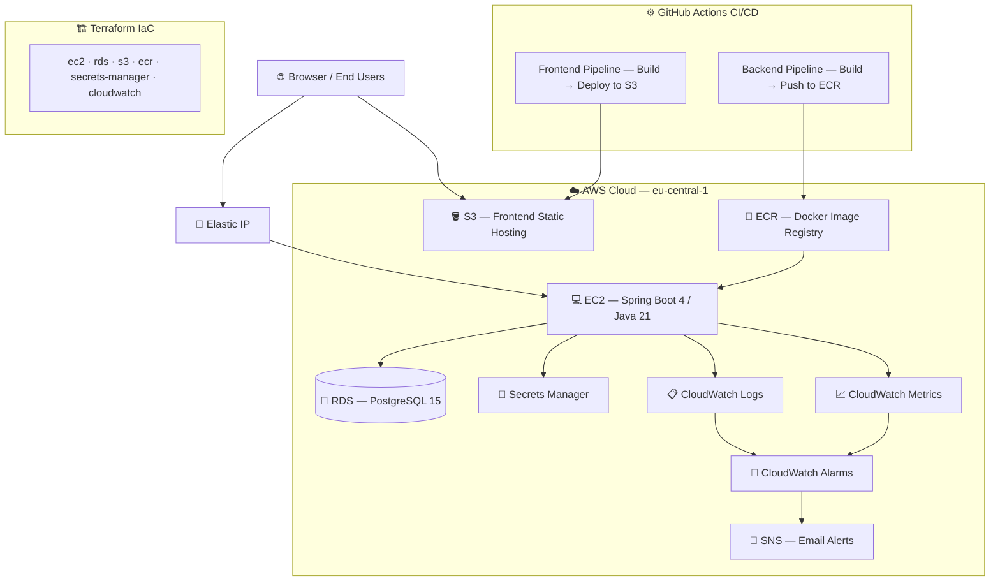

<p align="center">
  
</p>

<h1 align="center">🎓 ISTEAMX — University Timetable Management System</h1>

<p align="center">
  <strong>A full-stack platform for collaborative university scheduling with real-time conflict detection.</strong>
</p>

<p align="center">
  <a href="https://github.com/ISTEAMX/IS-Frontend/actions/workflows/build.yml"></a>
  <a href="https://github.com/ISTEAMX/IS-Frontend/actions/workflows/deploy.yml"></a>
  <a href="https://github.com/ISTEAMX/IS-Frontend/releases"></a>
</p>

<p align="center">
  <a href="https://github.com/ISTEAMX/IS-Backend/actions/workflows/build.yml"></a>
  <a href="https://github.com/ISTEAMX/IS-Backend/actions/workflows/deploy.yml"></a>
  <a href="https://github.com/ISTEAMX/IS-Backend/releases"></a>
</p>

<p align="center">
  
  
  
  
  
  
  
  
</p>

---

## 📋 Table of Contents

- [Overview](#-overview)
- [Architecture](#%EF%B8%8F-architecture)
- [Key Features](#-key-features)
- [User Roles](#-user-roles)
- [Tech Stack](#%EF%B8%8F-tech-stack)
- [Getting Started](#-getting-started)
- [Project Structure](#-project-structure)
- [Documentation](#-documentation)
- [Contributing](#-contributing)
- [License](#-license)

---

## 🌟 Overview

**ISTEAMX** is a production-grade university timetable management system built for a real faculty environment. It centralizes the management of classrooms, professors, student groups, and subjects — and **automatically prevents scheduling conflicts** in real-time. The system is deployed on AWS with a fully automated CI/CD pipeline.

---

## 🏗️ Architecture



---

## ✨ Key Features

| Feature | Description |
|---------|-------------|
| 🗓️ **Smart Scheduling** | Timetable management with automatic conflict detection for rooms, professors, and student groups |
| 🔍 **Advanced Filtering** | Filter the timetable by student group, professor, or classroom instantly |
| 🛡️ **Conflict Detection Engine** | Real-time validation prevents double-booking of any resource before saving |
| 📊 **Tabular Timetable View** | Weekly matrix (Mon–Fri, 2-hour slots) with color-coded activity types (Lecture, Lab, Seminar) |
| 🔐 **JWT Authentication** | Stateless, role-based security with Spring Security |
| 👥 **Role-Based Access Control** | Admins manage everything; Professors manage only their own entries; Students view only |
| 📦 **Full CRUD Management** | Administrative interface for rooms, professors, subjects, and student groups |
| 📈 **Monitoring & Alerting** | CloudWatch logs, metrics, alarms with SNS email notifications |
| 💰 **Cost Optimization** | Custom Power Scheduler GitHub Action to maintain $0.00 AWS bills |

---

## 👤 User Roles

| Role | Permissions |
|------|-------------|
| **🔑 Administrator** | Full CRUD on all resources. Manages rooms, professors, subjects, groups. Complete timetable editing rights. |
| **🎓 Professor** | Authenticated access. Can schedule, edit, and delete **their own** teaching activities only. |
| **📖 Student / Visitor** | Read-only access. Views the timetable with filtering by group, room, or professor. |

---

## 🛠️ Tech Stack

### Frontend — [`IS-Frontend`](https://github.com/ISTEAMX/IS-Frontend)
| Technology | Purpose |
|-----------|---------|
| React 19 | UI framework (Hooks, Context API) |
| TypeScript 5.9 | Type safety |
| Vite 7 | Build tool & dev server |
| Zustand | Lightweight state management |
| React Router 7 | Client-side routing |
| TanStack Table v8 | Data tables & grids |
| Axios | HTTP client |
| CSS Modules | Scoped styling |
| Vitest | Unit testing |

### Backend — [`IS-Backend`](https://github.com/ISTEAMX/IS-Backend)
| Technology | Purpose |
|-----------|---------|
| Java 21 | Language (Records, Virtual Threads) |
| Spring Boot 4.0.4 | Application framework |
| Spring Security + JWT | Authentication & authorization |
| Spring Data JPA | Data persistence (Hibernate) |
| PostgreSQL 15 | Relational database |
| Flyway | Database migrations |
| springdoc-openapi | API docs (Swagger UI) |
| Micrometer + CloudWatch | Metrics & monitoring |
| Lombok | Boilerplate reduction |
| Maven | Build & dependency management |

### DevOps & Infrastructure — [`IS-DevOps`](https://github.com/ISTEAMX/IS-DevOps)
| Technology | Purpose |
|-----------|---------|
| Terraform | Infrastructure as Code (modular) |
| Docker & Docker Compose | Containerization |
| GitHub Actions | CI/CD pipelines |
| AWS EC2 | Backend compute |
| AWS S3 | Frontend static hosting |
| AWS RDS | Managed PostgreSQL |
| AWS ECR | Docker image registry |
| AWS Secrets Manager | Credential management |
| AWS CloudWatch | Logging, metrics & alarms |

---

## 🚀 Getting Started

### Prerequisites

- **Java 21** — [Download](https://www.oracle.com/java/technologies/downloads/#java21)
- **Node.js 22+** — [Download](https://nodejs.org/)
- **Docker & Docker Compose** — [Download](https://www.docker.com/)
- **PostgreSQL 15+** — [Download](https://www.postgresql.org/) *(or use Docker)*

### Option 1: Run Everything with Docker Compose (Recommended)

```bash
# Clone all repositories
git clone https://github.com/ISTEAMX/IS-Frontend.git
git clone https://github.com/ISTEAMX/IS-Backend.git
git clone https://github.com/ISTEAMX/IS-DevOps.git

# Start the full stack
docker-compose -f IS-DevOps/docker-compose/docker-compose.yml up --build -d
```

| Service | URL |
|---------|-----|
| 🌐 Frontend | [http://localhost:80](http://localhost:80) |
| ⚙️ Backend API | [http://localhost:8080](http://localhost:8080) |
| 🐘 PostgreSQL | `localhost:5432` |

### Option 2: Run Services Individually

<details>
<summary><strong>▶️ Backend</strong></summary>

```bash
cd IS-Backend
cp .env.example .env   # Configure database & JWT settings
./mvnw spring-boot:run
```
API available at [http://localhost:8080](http://localhost:8080)
</details>

<details>
<summary><strong>▶️ Frontend</strong></summary>

```bash
cd IS-Frontend
npm install
npm run dev
```
App available at [http://localhost:5173](http://localhost:5173)
</details>

---

## 📂 Project Structure

```
ISTEAMX/
├── IS-Frontend/          # React 19 + TypeScript SPA
│   ├── src/
│   │   ├── api/          # Axios instance & HTTP client setup
│   │   ├── assets/       # Static assets (images, icons)
│   │   ├── components/   # Reusable UI (DataTable, Timetable, Header, Footer)
│   │   ├── constants/    # App-wide constants (room types, timetable config)
│   │   ├── hooks/        # Custom React hooks
│   │   ├── layouts/      # Layout wrappers (Main, Admin, Sidebar)
│   │   ├── pages/        # Route pages (Home, Login, Register, Admin)
│   │   ├── routes/       # Routing & route protection
│   │   ├── services/     # API service layer & error reporting
│   │   ├── store/        # Zustand state stores
│   │   ├── types/        # TypeScript type definitions
│   │   └── utils/        # Utility functions & helpers
│   └── docs/             # Frontend documentation
│
├── IS-Backend/           # Spring Boot 4 REST API
│   ├── src/main/java/    # Application source code
│   ├── src/main/resources/
│   │   └── db/migration/ # Flyway SQL migrations
│   └── docs/             # Backend documentation
│
└── IS-DevOps/            # Infrastructure & deployment
    ├── docker-compose/   # Local development stack
    ├── terraform/        # AWS infrastructure modules
    │   └── modules/      # EC2, RDS, S3, ECR, CloudWatch, Secrets Manager
    └── docs/             # DevOps documentation
```

---

## 📚 Documentation

Each repository contains a `docs/` folder with comprehensive documentation:

### Frontend Docs
| Document | Description |
|----------|-------------|
| [Project Overview](https://github.com/ISTEAMX/IS-Frontend/blob/main/docs/PROJECT_OVERVIEW.md) | Goals, audience, and business value |
| [Features](https://github.com/ISTEAMX/IS-Frontend/blob/main/docs/FEATURES.md) | Functional walkthroughs and user flows |
| [Architecture](https://github.com/ISTEAMX/IS-Frontend/blob/main/docs/ARCHITECTURE.md) | SPA structure deep-dive |
| [API Integration](https://github.com/ISTEAMX/IS-Frontend/blob/main/docs/API_INTEGRATION.md) | Service layer & backend communication |
| [Deployment](https://github.com/ISTEAMX/IS-Frontend/blob/main/docs/DEPLOYMENT.md) | Docker, Nginx, and CI/CD |

### Backend Docs
| Document | Description |
|----------|-------------|
| [Project Overview](https://github.com/ISTEAMX/IS-Backend/blob/main/docs/PROJECT_OVERVIEW.md) | Goals and system scope |
| [Architecture](https://github.com/ISTEAMX/IS-Backend/blob/main/docs/ARCHITECTURE.md) | Spring Boot layered design |
| [API Documentation](https://github.com/ISTEAMX/IS-Backend/blob/main/docs/API_DOCUMENTATION.md) | Full endpoint reference |
| [Database Design](https://github.com/ISTEAMX/IS-Backend/blob/main/docs/DATABASE_DESIGN.md) | ERD, entities, and relationships |
| [Deployment](https://github.com/ISTEAMX/IS-Backend/blob/main/docs/DEPLOYMENT.md) | Docker multi-stage builds |

### DevOps Docs
| Document | Description |
|----------|-------------|
| [AWS Architecture](https://github.com/ISTEAMX/IS-DevOps/blob/main/docs/AWS_ARCHITECTURE.md) | Cloud resource breakdown |
| [Security Architecture](https://github.com/ISTEAMX/IS-DevOps/blob/main/docs/SECURITY_ARCHITECTURE.md) | IAM, networking, secrets |
| [Infrastructure Provisioning](https://github.com/ISTEAMX/IS-DevOps/blob/main/docs/INFRASTRUCTURE_PROVISIONING.md) | Terraform lifecycle guide |
| [Deployment Guide](https://github.com/ISTEAMX/IS-DevOps/blob/main/docs/DEPLOYMENT_GUIDE.md) | S3 + ECR/EC2 deployment |
| [Monitoring](https://github.com/ISTEAMX/IS-DevOps/blob/main/docs/MONITORING.md) | CloudWatch & alerting setup |
| [Cost Management](https://github.com/ISTEAMX/IS-DevOps/blob/main/docs/COST_MANAGEMENT.md) | Power Scheduler & cost tips |

---

## 🤝 Contributing

We welcome contributions! Here's how to get started:

1. **Fork** the relevant repository
2. **Create** a feature branch (`git checkout -b feature/amazing-feature`)
3. **Commit** your changes (`git commit -m 'Add amazing feature'`)
4. **Push** to the branch (`git push origin feature/amazing-feature`)
5. **Open** a Pull Request

> 📖 See each repo's `docs/DEVELOPMENT_WORKFLOW.md` for coding standards, branching strategy, and PR guidelines.

---

## 📄 License

This project is licensed under the **MIT License** — see each repository's [LICENSE](LICENSE) file for details.

---

<p align="center">
  Made with ❤️ by the <strong>ISTEAMX</strong> team
</p>
